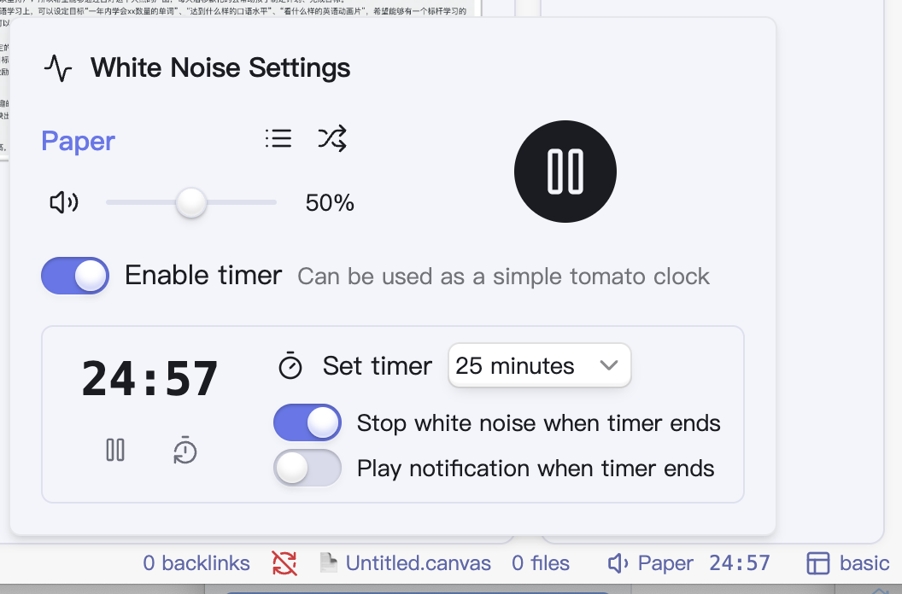

# 白噪音插件

[English Version](README.md)

为Obsidian 添加白噪音功能，旨在帮助用户更专注地、更平静地进入工作状态。

## 功能特点

- **白噪音**：包含雨声、咖啡厅噪音等数十种声音
- **音量控制**：单独控制白噪音音量，也许可以与你的音乐共存
- **计时器功能**：内置一个简单的番茄钟功能，可以与白噪音联动

## 截图

## 安装方法

1. 打开Obsidian，导航至**设置**
2. 进入**第三方插件**并关闭**安全模式**
3. 点击**浏览**并搜索"white noise"
4. 点击**安装**，然后**启用**插件

## 致谢

本插件使用了来自[Moodist](https://github.com/remvze/moodist)项目的声音素材。但为了更好地适用于 obsidian 环境，对一些声音素材进行了删改：

- 删除了部分可能让人紧张的音效（如雷声等）；
- 删除了少量体积过大的音频，以减小插件的体积；
- 对音频进行了再次压缩，修改为动态码率，合并双声道为联合立体声，仅保留 40Hz ~ 15000Hz 的声音；
- 删除基础噪音的音频，改成程序生成的方式动态生成。

考虑访问 [Moodist 项目](https://github.com/remvze/moodist) 以了解更多信息。
